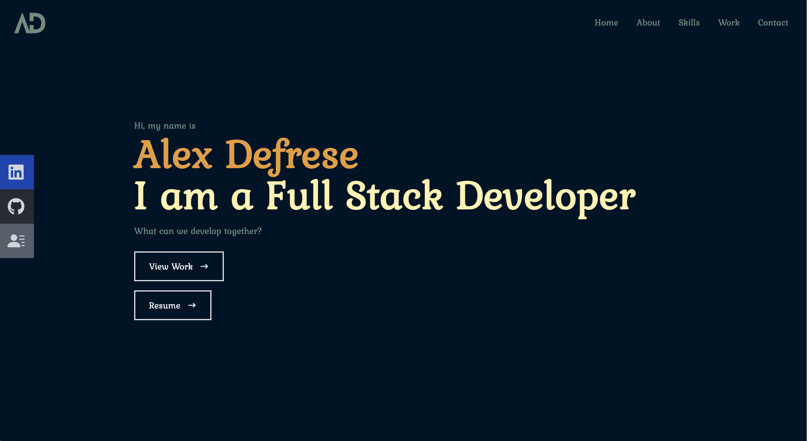

 # <u>Portfolio</u>

  

  

  ## <u>Table of Contents:</u>
  ### [License](#license)
  ### * [Description](#description)
  ### * [Installation](#install)
  ### * [Usage](#usage)
  ### * [Contributors](#contributors)
  ### * [Testing](#testing)
 ### * [Questions](#questions)

  ## License
  ### MIT

  ## <u>Description</u>
  ### This is an updated portfolio of my work. It is always changing so be sure and check back to see what new things I have been working on.

  ## <u>Installation:</u>
  ### Please follow these steps to install:
  ### No installation needed, just checkout the deployed link. 

  Pages: https://alexdefrese.github.io/Defrese-Portfolio-update/

  ## <u>Usage:</u>
  ### Either scroll through the site, or use the nav bar to jump to whichever section you would like. Also links in the About section take you to my work or resume. 

  ## <u>Contributors:</u> 
  ### Alex Defrese

  ## <u>Testing:</u>
  ### Please follow these steps to test the project:
  ### No testing at this time

  ## <u>Questions:</u> 
  ### If you have any questions or suggestions, please contact me through either
  ### GitHub: https://github.com/AlexDefrese
  ### or
  ### Email: aidandefrese@gmail.com
